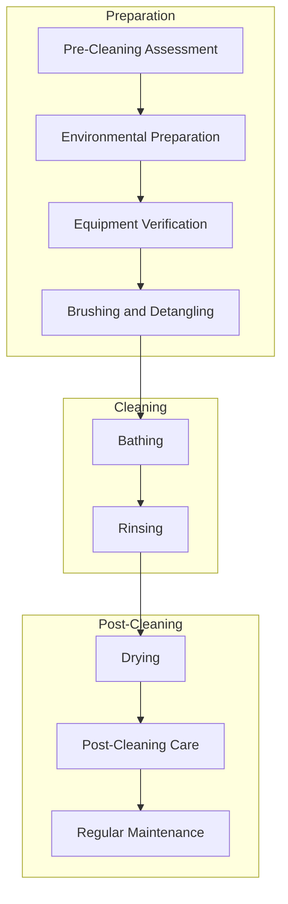

# **The Canine Cleansing Standard (CCS-2025)**  
The Ultimate Guide to Grooming and Bathing Your Dog. A systematic and standardized approach to maintaining optimal cleanliness and hygiene for your dog.
## Document Purpose:
This is a fictitious Standard to show case how to develop a standard using [GitHub](https://github.com/danielsiegl/CanineCleansingStandard), [SmartGit](https://www.syntevo.com/smartgit/) and [Obsidian](https://obsidian.md/).  See below for "Why Creating Standards with GitHub is a Smart Choice" for more details.

## CCS-2025 Table of Contents  

 
1. [Purpose](01_Purpose.md) 
   Explanation of the objectives and goals of the Canine Cleansing Standard.
2. [Equipment Standards](02_Equipment_Standards.md) 
   Specifications and requirements for tools and products used in canine cleansing.
3. [Preparation](03_Preparation.md) 
   Guidelines on preparing the dog and environment for the cleansing process.
4. [Cleaning Procedure](04_Cleaning_Procedure.md) 
   Step-by-step instructions for effectively cleaning your dog.
5. [Drying Protocol](05_Drying_Protocol.md) 
   Methods and best practices for drying your dog post-cleaning.
6. [Post Cleaning Care](06_Post-Cleaning_Care.md) 
   Recommendations for maintaining your dog's hygiene after cleansing.
7. [Frequency Recommendations](07_Frequency_Recommendations.md) 
   Suggested intervals for regular cleansing to ensure optimal health.
8. [Emergency Exceptions](08_Emergency_Exceptions.md) 
   Procedures to follow in case of urgent or unexpected situations.
9. [Eco-Friendly Cleaning](09_Eco-Friendly_Cleaning.md) 
   How to clean in an eco friendly way.
10. [Endorsement](10_Endorsement.md) 
   Information on official recognition and support for the standard.

# Why Creating Standards with GitHub is a Smart Choice

In today's fast-paced digital world, collaboration and transparency are key to creating effective industry standards. Whether in software development, engineering, or even niche areas like canine hygiene (yes, there’s a standard for that!), using GitHub to develop and publish standards provides numerous advantages.

A great example of this approach is the **Canine Cleansing Standard** ([GitHub Repository](https://github.com/danielsiegl/CanineCleansingStandard), [GitHub Pages](https://danielsiegl.github.io/CanineCleansingStandard/)), which demonstrates how GitHub can be used to create, manage, and publish structured standards efficiently. Here’s why you should consider this method for your own standardization efforts:

## 1. **Collaborative Development**

GitHub enables multiple contributors to collaborate on a standard, ensuring that it evolves with input from experts across the industry. Features like pull requests, issue tracking, and discussions make it easy to review, refine, and enhance content over time.

## 2. **Version Control and Transparency**

With GitHub, every change is tracked, allowing for complete transparency and accountability. Stakeholders can see exactly how a standard has evolved, compare versions, and even revert changes if needed. This ensures that updates are well-documented and auditable.

## 3. **Automated Publishing with GitHub Pages**

Once a standard is developed, GitHub Pages provides a simple yet powerful way to publish it as a professional-looking website. This makes the standard easily accessible to all stakeholders without requiring additional hosting services or complex deployments.

## 4. **PDF Generation for Formal Releases**

By leveraging GitHub’s release system, organizations can generate and distribute PDF versions of a standard. This ensures that official versions are clearly defined and easily downloadable for offline use or regulatory compliance.

## 5. **Community Engagement and Open Contributions**

GitHub fosters an open-source mentality, allowing a broader community to provide feedback and suggestions. This openness leads to higher adoption rates and stronger standards that reflect real-world needs.

## 6. **Automation and Continuous Improvement**

Through GitHub Actions and other automation tools, organizations can validate content, generate PDFs on release, and even integrate testing mechanisms to ensure consistency and quality in the standard’s development.

## Conclusion

Whether you’re developing a technical specification, an industry guideline, or even a standard for dog grooming best practices, GitHub provides a modern, transparent, and efficient way to create, manage, and publish standards. By embracing GitHub and GitHub Pages, organizations can foster better collaboration, ensure long-term accessibility, and establish clear, well-documented best practices that stand the test of time.

Are you considering using GitHub for your next standard? Let’s discuss how this approach could benefit your industry!